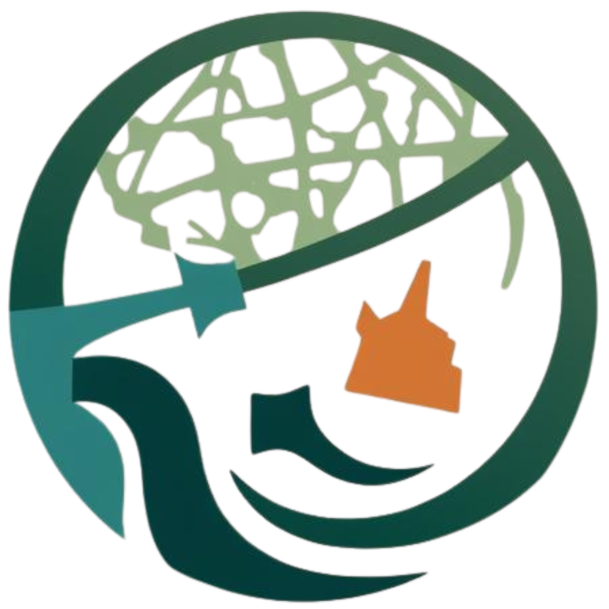

# 🌲 FRA Atlas - Forest Rights Act Digital Management System



## 📋 Project Overview

**FRA Atlas** is a comprehensive digital platform developed for **Smart India Hackathon (SIH) 2025** under **Problem Statement #25108**. It addresses the critical need for digitizing and managing Forest Rights Act (FRA) 2006 data, creating a centralized visual repository of FRA claims, and integrating satellite-based asset mapping with decision support systems.

### 🎯 Problem Statement Context

The Forest Rights Act (FRA), 2006 recognizes the rights of forest-dwelling communities over land and forest resources. However, significant challenges persist:

- **Legacy Data Issues**: Scattered, non-digitized FRA records that are difficult to verify
- **No Central Repository**: Missing real-time visual repository (FRA Atlas) of claims and titles
- **Integration Gaps**: Lack of satellite-based asset mapping integration with FRA data
- **Decision Support**: Absence of DSS to layer Central Sector Schemes (CSS) benefits for FRA patta holders

## ✨ Key Features

### 🔍 **AI-Powered Document Processing**
- **OCR Integration**: Extract and standardize text from scanned FRA documents
- **Named Entity Recognition (NER)**: Automatically identify village names, patta holders, coordinates, and claim status
- **Document Digitization**: Convert legacy paper records into structured digital format

### 🗺️ **Interactive WebGIS Platform**
- **Real-time FRA Atlas**: Visual repository of FRA claims and granted titles
- **Multi-layered Mapping**: IFR/CR boundaries, village boundaries, land-use classifications
- **Advanced Filtering**: Filter by state/district/village/tribal group
- **Progress Tracking**: Monitor FRA implementation at village/block/district/state levels

### 🛰️ **AI-Based Asset Mapping**
- **Satellite Image Analysis**: Computer Vision for detecting agricultural land, forest cover, water bodies
- **Land Use Classification**: ML models (Random Forest, CNN) for supervised classification
- **Asset Detection**: Identify homesteads, ponds, streams, and infrastructure
- **Multi-source Integration**: Forest data, groundwater data, PM Gati Shakti infrastructure

### 📊 **Decision Support System (DSS)**
- **Scheme Integration**: Cross-link FRA holders with CSS schemes (PM-KISAN, Jal Jeevan Mission, MGNREGA, DAJGUA)
- **AI-Enhanced Recommendations**: Rule-based + AI engine for optimal interventions
- **Priority Analysis**: Identify villages needing specific interventions (e.g., borewells for low water index areas)
- **Policy Formulation Support**: Data-driven insights for planning authorities

## 🏗️ Technical Architecture

### **Frontend** (React + Vite)
```
frontend/
├── src/
│   ├── components/         # Reusable UI components
│   ├── pages/             # Main application pages
│   ├── groups/            # User workflow management
│   ├── context/           # Authentication & state management
│   └── lib/               # Utilities & Supabase client
├── public/                # Static assets
└── package.json           # Dependencies & scripts
```

**Tech Stack:**
- **React 19.1.1** - Modern UI framework
- **Vite** - Fast build tool and dev server
- **Tailwind CSS** - Utility-first styling
- **React Router** - Client-side routing
- **Leaflet** - Interactive mapping
- **Supabase** - Backend-as-a-Service
- **Three.js** - 3D visualizations
- **Framer Motion** - Smooth animations

### **Backend** (Python Flask)
```
backend/
├── map.py                 # Google Earth Engine integration
├── ocr.py                 # Document processing & AI
├── water.py              # Water analysis tools
└── .env                  # Environment configuration
```

**Tech Stack:**
- **Flask** - Web framework
- **Google Earth Engine** - Satellite data processing
- **Google Gemini AI** - Document analysis
- **OpenCV** - Computer vision
- **NumPy** - Scientific computing

### **Database** (Supabase PostgreSQL)
- **Pattas Table**: Store FRA patta information
- **Real-time Updates**: Live synchronization
- **Authentication**: User management system
- **File Storage**: Document and image storage

## 🚀 Getting Started

### Prerequisites
- **Node.js** (v18 or higher)
- **Python** (v3.8 or higher)
- **Google Earth Engine** account
- **Supabase** project
- **Google Gemini API** key

### 🛠️ Installation

#### 1. Clone Repository
```bash
git clone https://github.com/ayanpandit/FRA_Atlas.git
cd FRA_Atlas
```

#### 2. Frontend Setup
```bash
cd frontend
npm install
```

Create `.env` file in frontend directory:
```env
VITE_SUPABASE_URL=https://your-project.supabase.co
VITE_SUPABASE_ANON_KEY=your-anon-key
```

#### 3. Backend Setup
```bash
cd backend
pip install flask flask-cors google-api-python-client earthengine-api google-generativeai python-dotenv requests opencv-python numpy
```

Create `.env` file in backend directory:
```env
RAPIDAPI_KEY=your-rapidapi-key
GEMINI_API_KEY=your-gemini-api-key
GOOGLE_EARTH_ENGINE_PROJECT=your-gee-project-id
```

#### 4. Database Setup
1. Create a Supabase project
2. Run the SQL schema from `supabase_schema.sql` in Supabase SQL Editor
3. Configure Row Level Security policies as needed

#### 5. Google Earth Engine Setup
```bash
earthengine authenticate
earthengine --project your-project-id
```

### 🏃‍♂️ Running the Application

#### Start Frontend (Development)
```bash
cd frontend
npm run dev
# Access at http://localhost:5173
```

#### Start Backend Services
```bash
# Terminal 1 - Map Service
cd backend
python map.py
# Runs on http://localhost:8080

# Terminal 2 - OCR Service  
cd backend
python ocr.py
# Runs on http://localhost:5001

# Terminal 3 - Water Analysis Service
cd backend  
python water.py
# Runs on http://localhost:5002
```

### 📦 Production Build
```bash
cd frontend
npm run build
npm run preview
```

## 👥 User Roles & Workflows

### 🏛️ **Admin Workflow**
- Complete system management
- User account management
- System configuration
- Data validation and approval

### 👨‍💼 **Officer Workflow** 
- FRA claim processing
- Document verification
- Status updates
- Report generation

### 👤 **User Workflow**
- Patta application submission
- Document upload
- Status tracking
- Benefit scheme access

## 📱 Key Pages & Components

### **Landing Page**
- Hero section with project overview
- Feature highlights
- User authentication portal
- Navigation to different workflows

### **Dashboard**
- Role-based dashboards
- Key metrics and statistics
- Quick access to main functions
- Real-time notifications

### **FRA Atlas (Map Interface)**
- Interactive WebGIS platform
- Multi-layer visualization
- Filtering and search capabilities
- Asset mapping overlay

### **Patta Management**
- Digital patta creation
- OCR-powered document processing
- QR code generation
- Status tracking

### **Schemes & Benefits**
- CSS scheme integration
- Eligibility checking
- Application processing
- Benefits tracking

### **Documentation Center**
- Digital archive
- Search functionality
- Document categories
- Version control

## 🔧 API Endpoints

### **Map Service** (Port 8080)
```
GET  /generate-map          # Generate satellite-based maps
POST /land-analysis         # Analyze land use patterns
GET  /asset-mapping         # Detect assets in satellite imagery
```

### **OCR Service** (Port 5001)
```
POST /ocr                   # Process uploaded documents
POST /extract-entities      # Named entity recognition
GET  /document-status       # Check processing status
```

### **Water Analysis** (Port 5002)
```
POST /water-analysis        # Analyze water bodies
GET  /water-index          # Calculate water availability
POST /drought-assessment    # Assess drought conditions
```

## 🎯 Target Users

- **Ministry of Tribal Affairs** - Policy formulation and monitoring
- **District Tribal Welfare Departments** - Implementation and coordination
- **Forest and Revenue Departments** - Land verification and management
- **Planning & Development Authorities** - Strategic planning
- **NGOs** - Community support and advocacy
- **FRA Patta Holders** - Direct beneficiaries

## 📊 Key Deliverables

1. **🗃️ AI-Processed Digital Archive**
   - Digitized FRA claims and decisions
   - Searchable document repository
   - Version control and audit trails

2. **🗺️ Interactive FRA Atlas**
   - WebGIS platform with multiple layers
   - Real-time data visualization
   - Advanced filtering and search

3. **🛰️ AI-Generated Asset Maps**
   - Comprehensive asset mapping for FRA villages
   - Land use classification
   - Infrastructure mapping

4. **🧠 Decision Support System**
   - Scheme layering engine
   - Policy recommendation system
   - Predictive analytics

## 🔮 Future Scope

### **Real-time Monitoring**
- Live satellite feeds for CFR forest monitoring
- Automated change detection
- Alert systems for unauthorized activities

### **IoT Integration**
- Soil health sensors in FRA lands
- Water quality monitoring systems
- Environmental parameter tracking

### **Mobile Platform**
- Native mobile applications
- Offline functionality
- Direct feedback from patta holders
- GPS-based field verification

### **Advanced Analytics**
- Machine learning models for prediction
- Blockchain for document authenticity
- AR/VR for immersive data visualization

## 🤝 Contributing

We welcome contributions! Please read our [Contributing Guidelines](CONTRIBUTING.md) for details on our code of conduct and the process for submitting pull requests.

### Development Guidelines
1. **Code Style**: Follow ESLint configuration for frontend, PEP 8 for Python
2. **Testing**: Ensure all new features include appropriate tests
3. **Documentation**: Update documentation for any new features
4. **Security**: Follow security best practices for handling sensitive data

## 📄 License

This project is licensed under the MIT License - see the [LICENSE](LICENSE) file for details.

## 🏆 Acknowledgments

- **Smart India Hackathon 2025** - For providing the platform
- **Ministry of Tribal Affairs** - For problem statement and guidance
- **Google Earth Engine** - For satellite data access
- **Supabase** - For backend infrastructure
- **Open Source Community** - For amazing tools and libraries

## 📞 Contact

**Team: troopers_abesec**
- **Project Lead**: [Your Name]
- **Email**: [your-email@domain.com]
- **GitHub**: [https://github.com/ayanpandit/FRA_Atlas](https://github.com/ayanpandit/FRA_Atlas)

---

## 🚀 Quick Start Commands

```bash
# Clone and setup
git clone https://github.com/ayanpandit/FRA_Atlas.git
cd FRA_Atlas

# Frontend
cd frontend && npm install && npm run dev

# Backend (in separate terminals)
cd backend && python map.py
cd backend && python ocr.py  
cd backend && python water.py
```

**Access the application at**: `http://localhost:5173`

---

*Built with ❤️ by Team troopers_abesec for Smart India Hackathon 2025 | Problem Statement #25108*

---

## 📚 Additional Documentation

- [API Documentation](docs/API.md)
- [Deployment Guide](docs/DEPLOYMENT.md)
- [User Manual](docs/USER_MANUAL.md)
- [Developer Guide](docs/DEVELOPER_GUIDE.md)
- [Database Schema](docs/DATABASE.md)